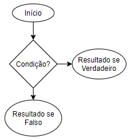

# Extruturas de Decisão ou Seleção

É comum nos códigos encontrarmos situações como a situação abaixo.



Ou seja, o programa irá tomar uma decisão diferente para condições diferentes. Existem duas formas de selecionar em Java, que serão explicadas nas subseções seguintes.

## If-Else

A seleção por if tem a forma apresentada abaixo. Depois da palavra-chave if é necessária uma expressão booleana entre parênteses. Caso a expressão booleana resulte no valor true em tempo de execução então o bloco seguinte será executado, caso resulte em false aquele será ignorado.

```{java}
if(condiçãoBooleana){
  //Instrução a ser executada caso a condiçãoBooleana seja verdadeira.
}
```

Existem também as variações do método if. Uma delas é o if/else. A instrução de seleção dupla if/else tem função complementar à de if: executa instruções no caso da expressão booleana de if resultar em false.

```{java}
if (condiçãoBooleana){
  //instruções que serão executadas caso a condiçãoBooleana resulte true.
} else {
  //instruções que serão executadas caso a condiçãoBooleana resulte false.
}
```

Complementar ao “if/else” temos o operador “else if”. Esse recurso possibilita adicionar uma nova condição à estrutura de decisão para atender a lógica sendo implementada.

```{java}
if (condiçãoBooleana) {
    //instruções que serão executadas caso a condiçãoBooleana resulte true.
} else if(outraCondiçãoBooleana){
    //instruções que serão executadas caso a outraCondiçãoBooleana resulte true.
}
```

## Operador Ternário

O operador ternário é uma forma compacta de se montar um operador *if-else*. Ele é utilizado para alocar valor em alguma determinada variável. Diferentemente do *if-else*, ele **não** realiza operações. Sua estrutura é igual ao apresentado abaixo.

```
var = (lógica booleana) ? (Valor 1):(Valor 2)
```

Ou seja, a variável `var` receberá qualquer um dos dois valores dependendo do resultado da lógica booleana, recebendo o `Valor 1` em caso de resultado igual a `true` e `Valor 2` em caso de resultado igual a false. Perceba o caso abaixo.

```{java}
public class Main {
    public static void main(String[] args) {
        int a = 7;
        int b = 6;
        String valor;
        valor = a > b ? "a é maior que b":"a é menor que b";
    }
}
```

Neste caso, como `a` de fato é maior que `b`, a lógica booleana resultará em um valor igual a `true`, retornando para a variável valor a string `"a é maior que b"`.

## Switch

O operador *switch* é muito útil para a tomada de decisões em um programa. Sua estrutura se assemelha à uma estrada, onde os caminhos já estão pré-determinados. Dessa forma, a decisão de qual caminho seguir é baseada no valor da entrada do decisor.


A estrutura do sistema de decisão igual ao apresentado abaixo. A função `switch` irá avaliar a variável `var`. Cada `case` corresponde a um possível valor que `var` pode assumir. Caso o valor de `var` não esteja presente em nenhuma das opções, o `switch` irá para a opção `default` que é a resposta padrão.

```{java}
switch (var){
    case Valor1:
        //Realiza as essas operações
        break;
    case Valor2:
        //Realiza as essas operações
        break;
    default:
        //Realiza as essas operações paadrão
        break;
}
```

A variável `var` pode ser de qualquer tipo (*int, double, string*...). Perceba o código apresentado abaixo. Se correr o código, será apresentado no console a resposta `“Muito!”`.

```{java}
public class Main {
    public static void main(String[] args) {
        String var = "Disposto?";
        switch (var){
            case "Oi, tudo bem?":
                System.out.println("Tudo! E com voce?");
                break;
            case "Bom dia!":
                System.out.println("Flor do Dia!");
                break;
            case "Disposto?":
                System.out.println("Muito!");
        }
    }
}
```

## Exercícios {-}

1. Qual a diferença entre uma estrutura de decisão estilo *if-else* e um Operador Ternário?
2. Crie um código em Java que contenha uma variável do tipo inteiro e que imprima no console se o número é par ou ímpar.
3. Faça um programa que contenha três variáveis: dinheiro, preço e limite do cartão. A variável “dinheiro” representa a quantidade de dinheiro presente na carteira, “preço” é o preço de um lanche e “limite no cartão” é o limite disponível para compras no cartão de crédito. O processo de análise é feito da seguinte forma (note que deve-se retornar, em caso de compra, qual o a opção de pagamento escolhida):
- Se houver dinheiro suficiente disponível na carteira, a compra será feita totalmente em dinheiro;
- Caso contrário, se houver limite disponível, a compra deverá ser feita totalmente no cartão de crédito;
- Caso contrário, deve-se analisar se é possível comprar o lanche juntando os valores de dinheiro disponível e limite de cartão;
-	Caso seja possível, deve-se pagar a totalidade do valor disponível em dinheiro e pagar o restante em cartão. Neste caso, deve-se dizer quanto será pago no cartão;
-	Caso contrário, deve-se retornar a mensagem “Você não pode pagar, que pena!”.
4. Utilizando a mesma situação do exercício anterior, acrescente agora a variável booleana "vontade", que é a vontade da pessoa em pagar o lanche utilizando o cartão. As análises que envolvem pagar com o cartão ficarão, então, em função dessa nova variável.
5. Faça um código que receba uma variável do tipo inteiro de valor entre 1 e 5, cada um correspondente a um dia útil da semana. O código deve imprimir no console o dia da semana correspondente. Caso a variável tenha um valor diferente, o programa deve imprimir no console a frase “Esse não é dia de feira!”.
6. Faça um código semelhante ao anterior. Crie uma variável do tipo *string* chamada idioma e faça com que o programa responda no console nos seguintes idiomas: português, inglês e espanhol. Caso seja inserido outro idioma, o programa deve responder “Idioma não reconhecido”.